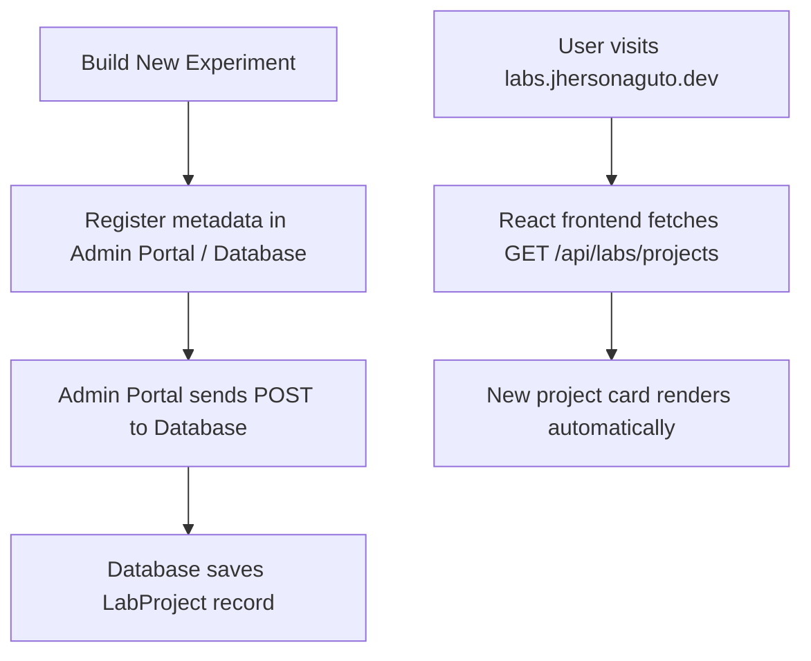

# Jherson Labs — API & Project Registry Integration

Jherson Labs (`labs.jhersonaguto.dev`) is a dynamic, frontend-only project explorer. Instead of hardcoding project cards or categories, the interface consumes a dynamic JSON API registry endpoint. 

This guide details how to implement the endpoint on your backend systems, how to configure the frontend client, and how to register new lab projects.

---

## 1. API Endpoint Specification

### `GET /api/labs/projects`
Retrieves the list of active experimental projects to render.

#### Request Headers
```http
Accept: application/json
```

#### Expected JSON Response Schema (`Array<LabProject>`)
```json
[
  {
    "id": "bg-remover-uuid",
    "slug": "bg-remover",
    "name": "BG Remover",
    "description": "AI-powered image background removal tool with upload, preview, and export workflow.",
    "category": "AI Tools",
    "status": "Live",
    "stack": ["Next.js", "API", "Image Processing"],
    "liveUrl": "https://labs.jhersonaguto.dev/bg-remover",
    "githubUrl": "https://github.com/jhersonaguto/labs",
    "imageUrl": null,
    "featured": true,
    "sortOrder": 1,
    "publishedAt": "2026-06-07T00:00:00Z",
    "updatedAt": "2026-06-07T00:00:00Z",
    "isPublished": true
  }
]
```

### Response Field Descriptions
| Field | Type | Description |
| :--- | :--- | :--- |
| `id` | `string` | Unique identifier (e.g., GUID or auto-increment ID). |
| `slug` | `string` | URL-safe name identifier matching sub-route paths. |
| `name` | `string` | Project name displayed on cards. |
| `description`| `string` | Brief description of the experiment. |
| `category` | `string` | Category grouping. **Dynamic filters on the UI are derived automatically from this field.** |
| `status` | `string` | State flag (e.g., `Live`, `Active`, `Prototype`, `Archived`). Controls pulsing indicators. |
| `stack` | `string[]` | List of tech stack badges. |
| `liveUrl` | `string` | URL to access the working lab tool. |
| `githubUrl` | `string` | Optional link to the project source code repository. |
| `imageUrl` | `string?` | Optional URL of the card preview thumbnail. If null or load fails, a CSS mesh mockup is shown. |
| `featured` | `boolean` | Flag to pin the project to the top "Featured Lab" hero slot. |
| `sortOrder` | `number` | Determines grid position (lower values appear first). |
| `publishedAt`| `string` | Date string (`YYYY-MM-DD` or ISO). Fallback order criteria. |
| `updatedAt` | `string` | Date string for modifications. Secondary sorting criteria. |
| `isPublished`| `boolean` | Flag to control public visibility. UI ignores records where this is `false`. |

---

## 2. Implementing the Endpoint

Since your developer workflow leverages ASP.NET Core, here is how you can implement this endpoint.

### ASP.NET Core Minimal API Example
```csharp
// Program.cs
app.MapGet("/api/labs/projects", async (ILabProjectRepository repo) =>
{
    var projects = await repo.GetPublishedProjectsAsync();
    
    // The React frontend handles sorting dynamically, but sending sorted data is best practice:
    var sorted = projects
        .Where(p => p.IsPublished)
        .OrderBy(p => p.SortOrder)
        .ThenByDescending(p => p.UpdatedAt ?? p.PublishedAt);

    return Results.Ok(sorted);
})
.WithName("GetLabProjects")
.WithOpenApi();
```

### ASP.NET Core Controller Example
```csharp
using Microsoft.AspNetCore.Mvc;

[ApiController]
[Route("api/labs")]
public class LabProjectsController : ControllerBase
{
    private readonly ILabContext _context;

    public LabProjectsController(ILabContext context)
    {
        _context = context;
    }

    [HttpGet("projects")]
    [Produces("application/json")]
    public async Task<IActionResult> GetProjects()
    {
        var projects = await _context.LabProjects
            .Where(p => p.IsPublished)
            .OrderBy(p => p.SortOrder)
            .ThenByDescending(p => p.UpdatedAt)
            .ToListAsync();

        return Ok(projects);
    }
}
```

---

## 3. Frontend Configuration

### Environment Variables
Configure the endpoint URL in your front-end build parameters (e.g., `.env.production` or `.env.local` files):

```env
VITE_LABS_API_URL=https://labs.jhersonaguto.dev/api/labs/projects
```

If `VITE_LABS_API_URL` is omitted, the service client defaults to:
`/api/labs/projects`

---

## 4. Flow for Launching New Experiments

When you build a new experiment (e.g., **BG Remover** or **GAS Forecasting Lab**):



1. **Write/Deploy the Lab**: Deploy the project to its subfolder/subdomain (e.g., `labs.jhersonaguto.dev/bg-remover`).
2. **Register Metadata**: Add the record into your CMS admin portal or insert a record into your SQL backend.
3. **Observe**: Refresh `labs.jhersonaguto.dev` — the project card, tech badges, and categories are compiled dynamically in the browser. No landing page deployments or updates are required.
# Labs
